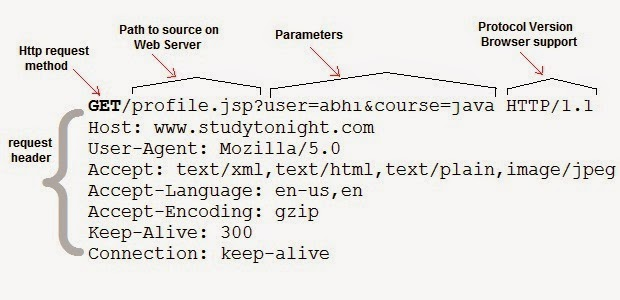
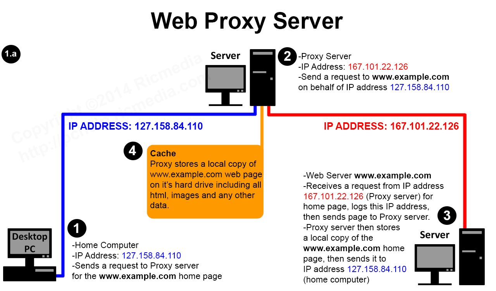
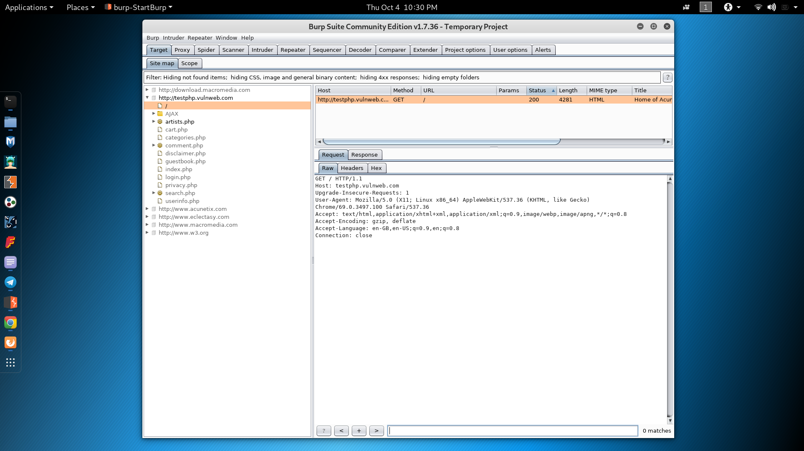
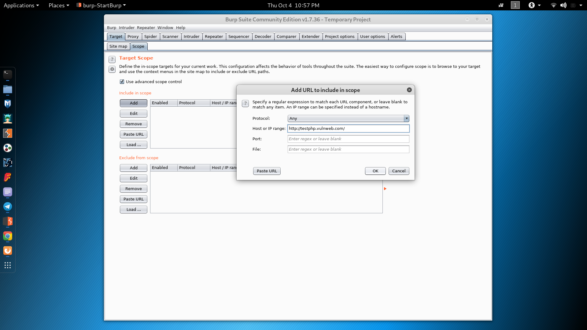
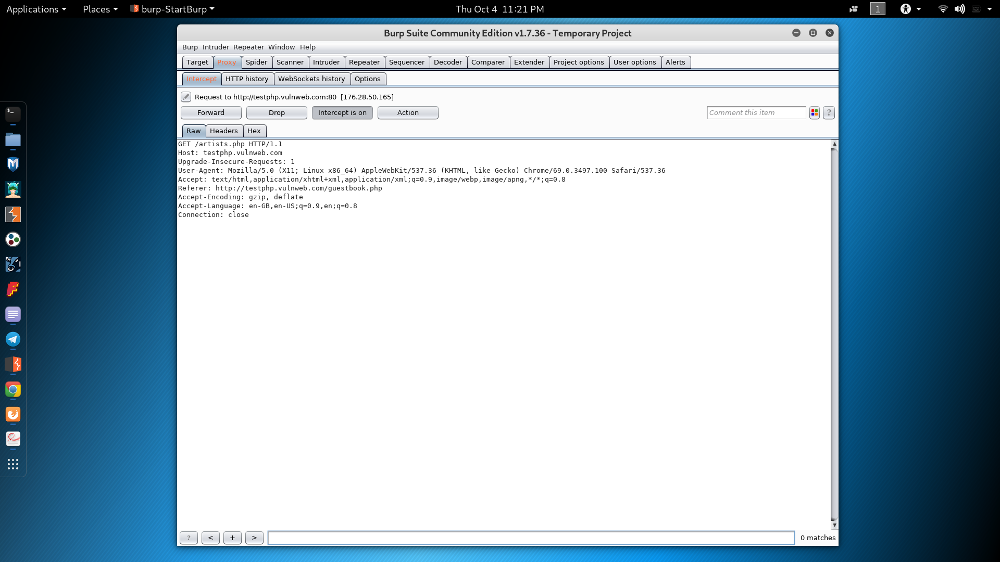
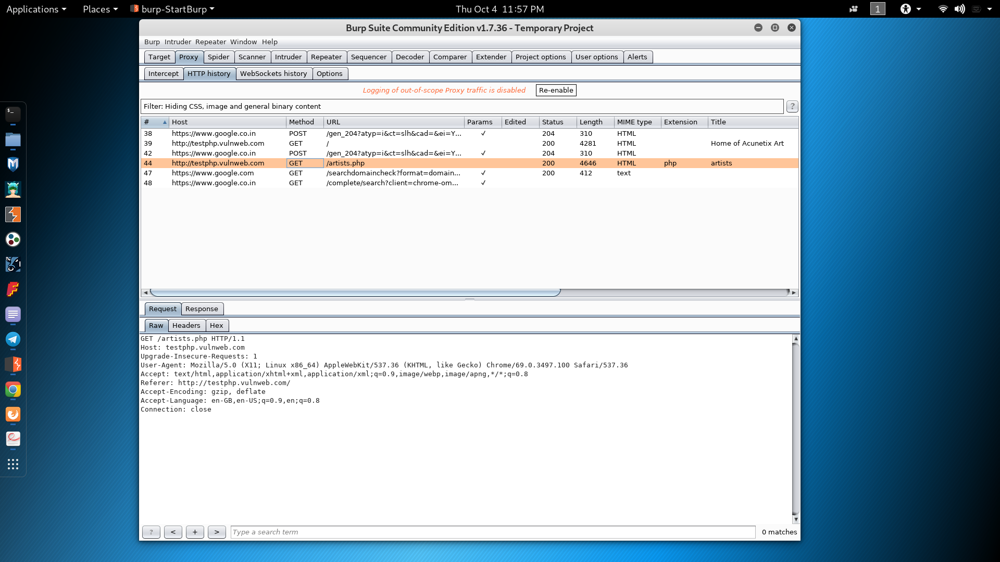
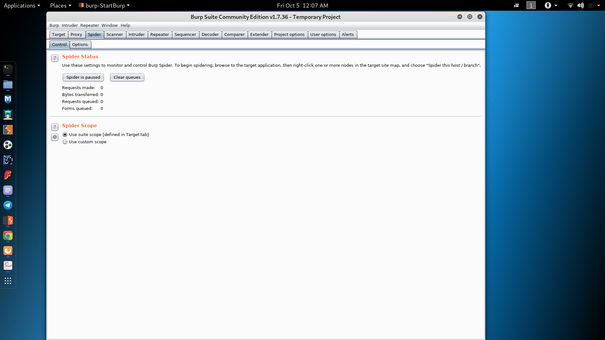
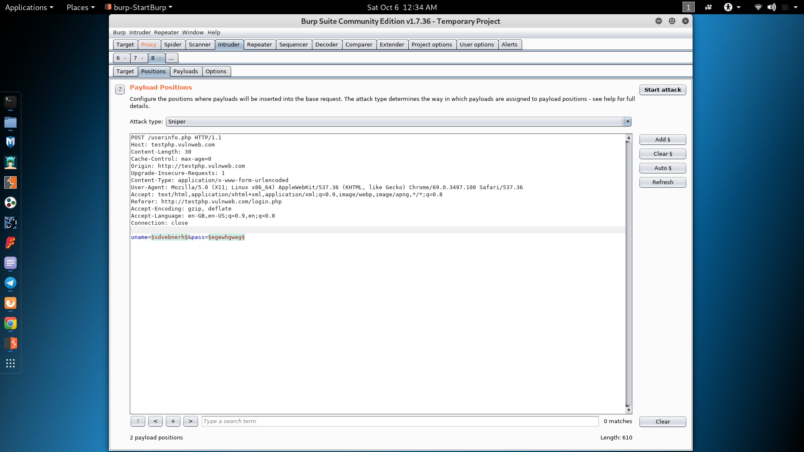
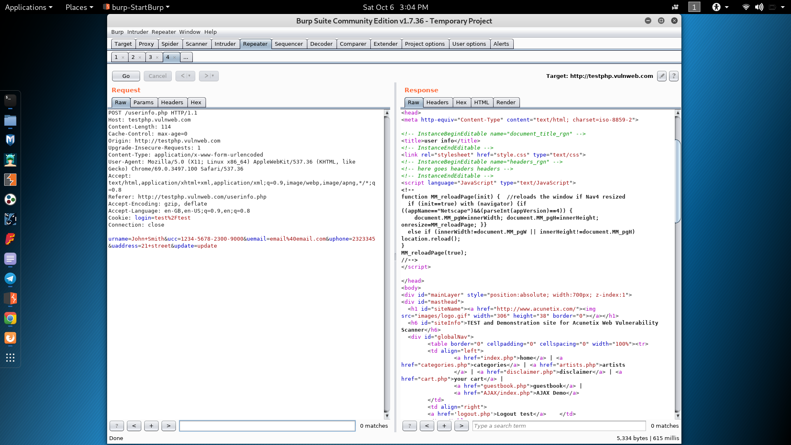

---
# Burp Suite

## ~Arpit
---
## Table of contents:
* <a href="#/3"> Get and Post requests </a>
* <a href="#/4"> PROXY SERVERS </a>
* <a href="#/5"> SETTING UP YOUR BURP SUITE </a>
* <a href="#/6"> BURP SITEMAP </a>
* <a href="#/7"> BURP PROXY </a>
* <a href="#/8"> SPIDER </a>
* <a href="#/9"> SCANNER </a>
* <a href="#/10"> INTRUDER </a>
* <a href="#/11"> REPEATER </a>
* <a href="#/12"> BURP DECODER </a>
* <a href="#/13"> BURP COMPARER </a>
* <a href="#/14"> FUZZDB </a>
* <a href="#/16"> REFERENCES </a>
---
## Get and Post requests
* Get and Post are HTTP request methods to transfer data from client to server.
* HTTP works as a request-response protocol between a client and server.
* Get - Requests data from a specified resource
* Post - Submits data to be processed to a specified resource
* Both GET and POST can be used to send request and receive response

----
## GET Method
* GET requests can be cached
* The GET method means retrieve whatever information is identified by the Request-URI.
* GET requests remain in the browser history
* GET can't be used to send binary data, like images or word documents, to the server.
* GET requests should never be used when dealing with sensitive data
* GET requests have length restrictions
* GET requests should be used only to retrieve data
* Eg: http://www.example.com/servlet?foo=bar

----
## POST Method
* POST requests are never cached
* POST requests do not remain in the browser history
* POST requests cannot be bookmarked
* POST requests have no restrictions on data length
* The POST method can be used to send ASCII as well as binary data.
* The data sent by POST method goes through HTTP header so security depends on HTTP
protocol. By using Secure HTTP you can make sure that your information is secure.
----
## Get Request

----
## Response

---

## Proxy servers

It is a intermediary server between the actual server and the client. So whatever request a browser(client) has to make, it first goes to the Proxy Server. 
All incoming data enters through one port and is forwarded to the other via another port.
----

---

## Setting up your Burp Suite

It is availble for Windows, Linux and MacOS. The community version is preinstalled in Kali Linux. So download and install the BurpSuite.
 [Click Here to Download](https://support.portswigger.net/customer/portal/articles/2327557-downloading-burp-software-and-your-license-key)
----
### Generating certificate

* Launch Burp Suite
* Go to the proxy tab, then go to the Intercept subtab and switch off the Intercept Button.
* Options tab -> Proxy Listeners -> Click on Generate Certificate
* Click on Import/Export CA Certificate 
* Choose Certificate in DER format in Export section and save the file.

----
### Importing the certificate
 <a href = "https://support.portswigger.net/customer/portal/articles/1783087-installing-burp-s-ca-certificate-in-firefox"> Refer to the link </a>
----
### Setting up proxy in the browser

There is a very good Chrome and Firefox extension available for easy and fast proxy switching called FoxyProxy. Download and install that.
Once that is done, go over to the options and add the proxy server. Put Host as 127.0.0.1 and port as 8080. (This is same as the proxy server we have setup in Burp Suite).

Now switch on this proxy. 
At this point of time, whatever requests you make will be visible in Burp Suite's HTTP History subtab (in Proxy tab) in clear text.

----
### Why do we need proxy server and what is the need to install the certificate ?

Since all the browser traffic now goes through burp's proxy server, thus it helps in intercepting the traffic and analysing it. 
The reason we install certificates is because we want all the requests and the responses in clear text.
---
## Burp sitemap

The left-hand-side tree view contains a hierarchical representation of content, with URLs broken down into domains, directories, files, and parameterized requests.
----

----
## Scope

It helps to limit the request intercepts to the website or the domain that we define. Thus helps in better analysis, rather than junk from all the websites sitting on the sitemap and HTTP history.
----

---

## Proxy
### Intercept subtab

If the intercept is switched on, the interceptor stops each request from the browser. Those requests can be tampered with and can be resent or can also be dropped. Resending can done by the forward button.

These requests can also be forwarded to the spider, intruder, repeater, sequencer, comparer or decoder. These things can be performed by the action button.
It is also possible to intercept the response from the server, tamper and sent out.
----

----

### HTTP History

It contains all the history of the all the requests and responses. Again all the requests can be forwarded to the other tools.

---

## Spider

"The crawl phase of a scan involves navigating around the application, following links, submitting forms, and logging in where necessary, to catalog the content of the application and the navigational paths within it. This seemingly simple task presents a variety of challenges that Burp's crawler is able to meet, to create an accurate map of the application."

The spider can start from a given page. For eg if you forward a request to spider in the target or http traffic tabs.
----
Burp's spider can automatically fill forms or perform logins of provided with appropriate detail and continue crawling and creating the directory structure of the website.

The HTTP headers can also be set as we there can be a custom user agent etc.

The spider can also read robots.txt file which specifies some web pages not to crawl. So Burp's Spider tool even crawls those webpages and could find admin logins etc.
----

---

## Scanner

Scanner is not available in community edition of Burp Suite. It is basically a complete framework to scan websites for vulnerablities and create reports.
Since this is not a part of community edition, I have not taken this up.
---

## Intruder
The Burp Suite Intruder is a really great and powerful way to perform automated and semi-targeted fuzzing. You can use it against one or more parameters in an HTTP request. Right click on any request just as we did before and this time select “Send to Intruder”. Head over to the “Intruder” tab and click on the “Positions” sub-tab. You will see the the points where the payloads can be inserted.
Payloads can be inserted in any of the parameters. 

----
The payload marker specifies these parameter on which attack is wanted. Payload marker can be set manually to any parameter and attack can be performed.

Using the intruder, we can brute force logins or try SQl injections or XSS or other web vulnerabilites.
----
Since intruder is a massive tool, I recommend to go through the below documentation link.

To understand the attack types [Click Here](https://www.sjoerdlangkemper.nl/2017/08/02/burp-intruder-attack-types/)

 [Burp Intruder Docs](https://portswigger.net/burp/documentation/desktop/tools/intruder)
 

----

---

## Repeater
Burp Repeater is a simple tool for manually manipulating and reissuing individual HTTP requests, and analyzing the application's responses. You can send a request to Repeater from anywhere within Burp, modify the request and issue it over and over. 

* Controls to issue requests and navigate the request history. The target server to which the request will be sent is shown - you can click on the target details to change these.
----
* An HTTP message editor containing the request to be issued. You can edit the request and reissue it over and over.
* An HTTP message editor showing the response that was received from the last issued request.

----

## Burp Repeater options

* Update Content-Length - This option controls whether Burp automatically updates the Content-Length header of the request where necessary. Using this option is normally essential when the request message contains a body.
* Unpack GZIP / deflate - This option controls whether Burp automatically unpacks GZIP- and deflate-compressed content received in responses.
* Follow redirections - This setting controls whether redirection responses are automatically followed. 
----
* Process cookies in redirections - If this option is selected, then any cookies set in the redirection response will be resubmitted when the redirection target is followed.
* View - This submenu lets you configure the layout of the request/response panel. You can view the HTTP messages in a top/bottom split, a left/right split, or in tabs.
* Action - This submenu contains the same options as are available on via the context menu of the request and response message editors.

----

---

## Burp decoder

Burp Decoder is a simple tool for transforming encoded data into its canonical form, or for transforming raw data into various encoded and hashed forms. It is capable of intelligently recognizing several encoding formats using heuristic techniques. 

* URL
* HTML
* Base64
* ASCII hex
* Hex
----
* Octal
* Binary
* GZIP

---

##  Burp Comparer

Burp Comparer is a simple tool for performing a comparison (a visual "diff") between any two items of data. Some common uses for Burp Comparer are as follows:

* When looking for username enumeration conditions, you can compare responses to failed logins using valid and invalid usernames, looking for subtle differences in the responses.
----
* When an Intruder attack has resulted in some very large responses with different lengths than the base response, you can compare these to quickly see where the differences lie.
* When comparing the site maps or Proxy history entries generated by different types of users, you can compare pairs of similar requests to see where the differences lie that give rise to different application behavior.
* When testing for blind SQL injection bugs using Boolean condition injection and other similar tests, you can compare two responses to see whether injecting different conditions has resulted in a relevant difference in responses.

---
## FuzzDB

It is a comprehensive open dictionary of fault injection patterns, predictable resource locations, and regex for matching server responses.
This is contains dictionary for alot attacks like SQL Injection, XSS, Server Side Inlcude, error reponse from the server etc. This data can be included in the Burp Suite and accordingly perform Fuzzing.
Different attacks are contained in https://github.com/fuzzdb-project/fuzzdb/tree/master/attack

---
## Endnote
This is the basics of the tools available in Burp. For detailed documentation, visit [Burp Suite tools](https://portswigger.net/burp/documentation/desktop/tools)

To perform tests and practise, you may use http://testphp.vulnweb.com website. It is legal to perform the test on this website subjected to their terms and conditions.
---

## References

https://www.youtube.com/watch?v=h2duGBZLEek&t=1638s
https://portswigger.net/burp/documentation/desktop/tools
https://www.computerweekly.com/tutorial/Burp-Suite-Guide-Part-I-Basic-tools
https://www.pentestgeek.com/web-applications/burp-suite-tutorial-1
https://portswigger.net/burp/documentation
https://kalilinuxtutorials.com/burpsuite/

